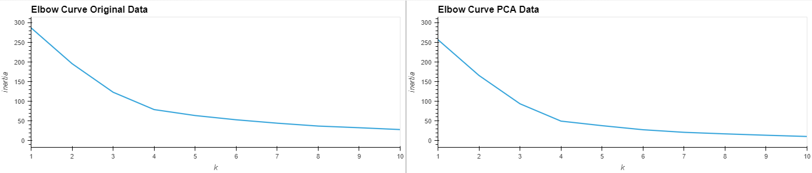

# CryptoClustering

The cryptocurrency is a digital currency, which is an alternative form of payment created using encryption algorithms.In this challenge, we will use learnhow to use the unsupervised machine learning to make prediction about cryptocurrency.

## What we will learn from this project:

- How to find the Best Value for k

- How to create clusters  with K-means

- How to optimize Clusters with Principal Component Analysis

## Instructions: 

### Prepare the Data:

- Use the StandardScaler() module from scikit-learn to normalize the data from the CSV file.

- Create a DataFrame with the scaled data and set the "coin_id" index from the original DataFrame as the index for the new DataFrame.
  
### Find the Best Value for k Using the Original Scaled DataFrame

- Use the elbow method to find the best value for k.

- Plot a line chart with all the inertia values computed with the different values of k to visually identify the optimal value for k.

- Identify the best value for k.

### Cluster Cryptocurrencies with K-means Using the Original Scaled Data

- Cluster the cryptocurrencies for the best value for k on the original scaled data.
  
- Create a scatter plot using hvPlot.

### Optimize Clusters with Principal Component Analysis

- Perform a PCA and reduce the features to three principal components.

- Retrieve the explained variance to determine how much information can be attributed to each principal component.

- Identify the total explained variance of the three principal components.
  
- Create a new DataFrame with the PCA data and set the "coin_id" index from the original DataFrame as the index for the new DataFrame.

### Find the Best Value for k Using the PCA Data

- Use the elbow method on the PCA data to find the best value for k.

- Plot a line chart with all the inertia values computed with the different values of k to visually identify the optimal value for k.

- Identify the best value for k when using the PCA data.

### Cluster Cryptocurrencies with K-means Using the PCA Data

- Cluster the cryptocurrencies for the best value for k on the PCA data:
  
- Create a scatter plot using hvPlot.
  
- Identify the impact of using fewer features to cluster the data using K-Meas.
 
 ## Program:
 
 ### Tools:

- Visual Studio Code (VSCode): is a free, open-source code editor developed by Microsoft.

- Python: is a high-level programming language known for its simplicity, readability, and versatility. 

- Pandas: is a Python library for data manipulation and analysis.

- hvplot.pandas: is a high-level visualization library for Python that works in conjunction with Pandas DataFrames.

- sklearn: is a machine learning library for Python. 

### Code:

#### Functions Defined

##### Compute inertia values for K-Means clustering
```
# Create a function to compute inertia values for K-Means clustering

def compute_inertia_values(k_values, data):
    """
    Compute inertia values for K-Means clustering.

    Inputs:
        k_values (list): A list of integers representing the number of clusters to evaluate.
        data (DataFrame): The data to be clustered.

    Output:
        list: A list of inertia values, one for each value of k.
    """

    # Create an empty list to store the inertia values
    inertia = []

    # Create a for loop to compute the inertia with each possible value of k
    for i in k_values:

        # Create a KMeans model using the loop counter for the n_clusters
        k_model = KMeans(n_clusters=i, random_state=random_state)

        # Fit the model to the data using `data`
        k_model.fit(data)

        # Append the model.inertia_ to the inertia list
        inertia.append(k_model.inertia_)

    # Return the list of inertia
    return inertia
```

##### Create a DataFrame for plotting the Elbow curve
```
def elbow(k_values, inertia_values):
    """
    Create a DataFrame for plotting the Elbow curve.

    Inputs:
        k_values (list): A list of integers representing the number of clusters to evaluate.
        inertia_values (list): A list of inertia values corresponding to each value of k.

    Outputs:
        DataFrame: A DataFrame containing the data for plotting the Elbow curve.
    """


    # Create a dictionary with the data to plot the Elbow curve
    elbow_data = {"k": k_values, "inertia": inertia_values}
    
    # Create a DataFrame with the data to plot the Elbow curve
    df_elbow = pd.DataFrame(elbow_data)
    
    # Return the dataframe 
    return df_elbow
```

##### Cluster data using K-Means
```
def cluster_data_with_kmeans(model, data, cluster_col_name):
    """
    Cluster data using K-Means.

    Inputs:
        model (object): The K-Means model to be used for clustering.
        data (DataFrame): The data to be clustered.
        cluster_col_name (string): The name of the column to store cluster labels.

    Outputs:
        DataFrame: A copy of the input data with an additional column for cluster labels.
        kmeans_predictions: An array of cluster labels for the data.
    """
    
    # Fit the K-Means model to the data
    model.fit(data)
    
    #Predict the clusters to group the cryptocurrencies
    kmeans_predictions = model.predict(data)
    
    # Create a copy of the data and add the cluster predictions as a new column
    data_with_clusters = data.copy()
    data_with_clusters[cluster_col_name] = kmeans_predictions
    
    #Return the Dataframe and the Kmeans predictions array
    return data_with_clusters, kmeans_predictions
```
##### Create a scatter plot using hvplot.scatter
```
def generate_scatter_plot(data, x_col, y_col, clusters, hover_cols, title):
    """
    Generate a scatter plot for the given data.

    Inputs:
        data (DataFrame): The data to be plotted.
        x_col (string): The name of the column to use for the x-axis.
        y_col (string): The name of the column to use for the y-axis.
        clusters (string): The name of the column to use for grouping data points.
        hover_cols (list of strings): The columns to display in the hover tooltip.
        title (string): The title of the scatter plot.

    Outputs:
        scatter_plot: A scatter plot of the data.
    """
    # Plot a scatter
    scatter_plot = data.hvplot.scatter(
        x=x_col,
        y=y_col,
        by=clusters,
        hover_cols=hover_cols
    ).opts(
        title=title
    )

    # Return the plot
    return scatter_plot
```
### Plots:



